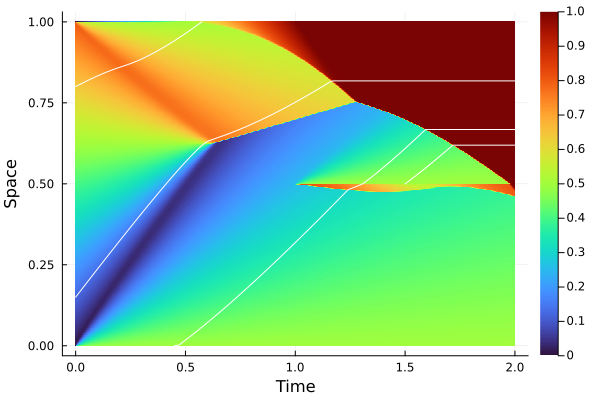

# MacroMicroSimulator

## Macro simulator

This package provides a numerical solution to the viscous / inviscid quasilinear equation


where &#947; is positive or null.

The unknown is the density function &#961;: [0, T] x [0, L] -> [0, 1]. Initial condition and 2 boundary conditions must be provided. The flux function *f* is defined such that
* *f* is concave
* *f(&#961;) = V<sub>f</sub> &#961; + o(&#961;)*
These conditions are coming from [[1]](http://proceedings.mlr.press/v144/barreau21a.html).

```julia
using MacroMicroSimulator

flux = MacroMicroSimulator.Flux(ρ -> ρ * (1 - ρ), 0.5, 1.0)

simulator = MacroMicroSimulator.Simulator(1.0f0, 2.0f0, 1000, flux, γ=0)
initial_condition(simulator, x -> 0.8 * x)
top_boundary_condition(simulator, identity)
bottom_boundary_condition(simulator, x -> 0.9)

compute(simulator)

MacroMicroSimulator.plot(simulator) |> display
```

For more information, please see the documentation.

## Micro simulator

Based on the density function, it is possible to generate trajectories of particles since their speed in the flow is defined as *V(&#961;) = f(&#961;) / &#961;*.

```julia
probe_vehicles = MacroMicroSimulator.Sensors([0.1f0, 0.5f0, 0.8f0], simulator)

compute(probe_vehicles)

MacroMicroSimulator.plot(probe_vehicles) |> display
```

The output of this example is given below.



For more information, please see the documentation.

# Aknowledgement

Please cite [[1]](http://proceedings.mlr.press/v144/barreau21a.html) if you use this script.

# Reference

[1] [M. Barreau, J. Liu, K. H. Johansson. Learning-based State Reconstruction
for a Scalar Hyperbolic PDE under noisy Lagrangian Sensing, *Proceedings of the 3rd Conference on Learning for Dynamics and Control*, PMLR 144:34-46, 2021](http://proceedings.mlr.press/v144/barreau21a.html)